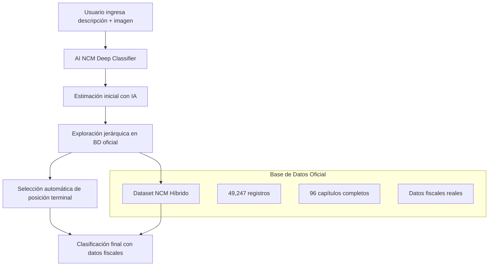

# 📋 Sistema de Clasificación Arancelaria NCM - Documentación Completa

## 🎯 Descripción General

El sistema de clasificación arancelaria automatiza la determinación de códigos NCM (Nomenclatura Común del Mercosur) para productos importados a Argentina, utilizando inteligencia artificial especializada y una base de datos oficial completa.

## 🏗️ Arquitectura del Sistema

### Componentes Principales



### Módulos del Sistema

1. **🤖 AI NCM Deep Classifier** (`ai_ncm_deep_classifier.py`)
   - Coordinador principal del proceso
   - Implementa el flujo de 3 fases
   - Maneja fallbacks inteligentes

2. **🏛️ NCM Official Integration** (`ncm_official_integration.py`)
   - Interfaz con la base de datos oficial
   - Búsquedas exactas y jerárquicas
   - Enriquecimiento de datos fiscales

3. **📊 NCM Position Matcher** (`ncm_position_matcher.py`)
   - Motor de búsqueda avanzado
   - Algoritmos de similitud
   - Selección por IA

4. **🔍 NCM Extractor Hybrid** (`ncm_extractor_hybrid_fix.py`)
   - Extractor de datos desde PDFs oficiales
   - Procesamiento híbrido inteligente
   - Generación de datasets consolidados

## 🚀 Flujo de Clasificación (3 Fases)

### 📋 FASE 1: Estimación Inicial con IA

**Objetivo:** Obtener una primera aproximación usando expertise de despachante de aduanas.

**Proceso:**
1. Análisis de descripción del producto e imagen (si existe)
2. Aplicación de prompt especializado con conocimiento de:
   - Sistema Armonizado (SA)
   - Nomenclatura Común del Mercosur (NCM)
   - RG AFIP 5631/2025 (régimen simplificado)
   - Reglas Generales de Interpretación (RGI)

**Prompt del Despachante:**
```python
CUSTOMS_AGENT_SYSTEM_PROMPT = """
Eres un DESPACHANTE DE ADUANAS ARGENTINO con más de 20 años de experiencia...

METODOLOGÍA DE CLASIFICACIÓN:
1. Análisis técnico detallado
2. Aplicación de Reglas Generales de Interpretación (RGI)
3. Búsqueda de la posición más específica
4. Validación arancelaria
5. Análisis de intervenciones

CRITERIOS DE PRECISIÓN:
- SIEMPRE busca el código NCM más específico disponible
- Prefiere posiciones terminales con sufijo SIM
- Considera características técnicas específicas
- Analiza finalidad/uso del producto
"""
```

**Salida:**
```json
{
  "ncm_inicial_estimado": "9603.90.00",
  "justificacion_ncm_inicial": "Explicación técnica...",
  "nivel_confianza_inicial": "Alta|Media|Baja",
  "requiere_exploracion_profunda": true/false
}
```

### 🔍 FASE 2: Exploración Jerárquica Profunda

**Objetivo:** Buscar en la base de datos oficial la posición más específica disponible.

**Estrategias de Búsqueda:**

#### 1. Búsqueda Exacta
```python
exact_match = ncm_integration.search_exact_ncm("9603.90.00")
```

#### 2. Búsqueda Jerárquica con Múltiples Estrategias
```python
# Estrategia 1: Por prefijo jerárquico (8, 6, 4, 2 dígitos)
# Estrategia 2: Sin últimos ceros (.00)
# Estrategia 3: Por capítulo como fallback
hierarchical_matches = ncm_integration.search_hierarchical_ncm("9603.90.00", max_results=10)
```

#### 3. Análisis de Subcategorías con LLM
Si se encuentra una posición intermedia, se exploran todas las subcategorías:
```python
best_subcategory = await _analyze_subcategories_with_llm(
    subcategories, product_description, parent_position
)
```

**Criterios de Evaluación:**
- Posiciones terminales tienen prioridad sobre subcategorías
- Códigos con sufijo SIM son preferidos
- Se evalúa coherencia con descripción del producto

### 🎯 FASE 3: Determinación de Clasificación Final

**Objetivo:** Seleccionar la mejor posición y construir la respuesta completa.

**Proceso de Selección:**
1. Evaluación de todos los candidatos encontrados
2. Aplicación de criterios de confianza
3. Construcción de clasificación final con datos fiscales
4. Aplicación de fallbacks si es necesario

## 🗄️ Base de Datos Oficial NCM

### Estructura del Dataset

**Archivo Principal:** `dataset_ncm_HYBRID_FIXED_YYYYMMDD_HHMMSS.json`

**Estadísticas:**
- **Total registros:** 49,247
- **Capítulos procesados:** 96 (del 1 al 97)
- **Códigos NCM únicos:** 10,283
- **Registros terminales:** 35,004 (71.1%)
- **Subcategorías:** 14,243 (28.9%)

### Estructura de Registro

```json
{
  "file": "capitulo_96.pdf",
  "chapter": 96,
  "code": "9603.90.00",
  "sim": "110J",
  "description": "Escobas",
  "aec": 18.0,
  "die": 18.0,
  "te": 3.0,
  "in": "LNA",
  "de": 0.0,
  "re": 0.0,
  "code_searchable": "96039000",
  "parent": "960390",
  "parent_searchable": "960390",
  "hierarchy_level": 4,
  "record_type": "terminal"
}
```

### Campos Importantes

| Campo | Descripción | Ejemplo |
|-------|-------------|---------|
| `code` | Código NCM completo | "9603.90.00" |
| `sim` | Sufijo SIM específico | "110J" |
| `description` | Descripción oficial | "Escobas" |
| `aec` | Arancel Externo Común (%) | 18.0 |
| `die` | Derecho de Importación Específico (%) | 18.0 |
| `te` | Tasa Estadística (%) | 3.0 |
| `in` | Código de Intervenciones | "LNA" |
| `record_type` | Tipo: "terminal" o "subcategory" | "terminal" |

## 💰 Tratamiento Arancelario

### Datos Fiscales Extraídos

```python
"tratamiento_arancelario": {
    "derechos_importacion": "18.0%",  # AEC
    "die": "18.0%",                   # Derecho Específico
    "tasa_estadistica": "3.0%",       # Tasa Estadística
    "iva": "21.0%",                   # IVA Argentina
    "in_code": "LNA",                 # Código Intervenciones
    "fuente": "Base de Datos Oficial NCM"
}
```

### Interpretación de Códigos IN

| Código | Significado |
|--------|-------------|
| LNA | Licencia No Automática |
| SIN | Sin Intervenciones |
| ANM | ANMAT (Productos de Salud) |
| SEN | SENASA (Productos Agropecuarios) |
| INT | INTI (Productos Industriales) |

## 🛡️ Sistema de Fallbacks

### Nivel 1: Fallback por Estimación Inicial
Si la exploración jerárquica falla pero la estimación inicial tiene confianza Alta/Media:
```python
if initial_ncm and initial_confidence in ["alta", "media"]:
    # Usar estimación inicial como clasificación final
    fallback_classification = {
        "ncm_completo": initial_ncm,
        "clasificacion_source": "fallback_initial_estimation",
        "observaciones_adicionales": "⚠️ Clasificación de fallback..."
    }
```

### Nivel 2: Fallback de Emergencia
Como último recurso:
```python
emergency_classification = {
    "ncm_completo": "9999.99.99",
    "ncm_descripcion": "Clasificación temporal - Requiere revisión manual",
    "requires_manual_review": True
}
```

## 🔍 Debugging y Logs

### Niveles de Log
- **FLOW:** Flujo principal de fases
- **SUCCESS:** Operaciones exitosas
- **INFO:** Información general
- **DEBUG:** Detalles de búsqueda
- **WARNING:** Situaciones de fallback
- **ERROR:** Errores críticos

### Información de Debug Disponible

```python
{
  "debug_info": {
    "estimation_phase": { /* Detalles de fase 1 */ },
    "exploration_phase": { /* Detalles de fase 2 */ },
    "search_attempts": { /* Intentos de búsqueda */ }
  },
  "process_steps": [
    {
      "phase": "initial_estimation",
      "status": "completed",
      "ncm_estimated": "9603.90.00",
      "confidence": "alta"
    }
  ]
}
```

## 🔧 Configuración y Mantenimiento

### Archivos de Configuración

**streamlit_ai_comercio_exterior.py:**
```python
CONFIG = {
    'NCM_DATA_FILE': "pdf_reader/ncm/resultados_ncm_hybrid/dataset_ncm_HYBRID_FIXED_20250807_125734.csv",
    'DEBUG_MODE': True,
    'MAX_DEBUG_LOGS': 50
}
```

### Actualización del Dataset

1. **Ejecutar extractor híbrido:**
```bash
cd pdf_reader/ncm
python3 ncm_extractor_hybrid_fix.py
```

2. **Actualizar configuración:**
```python
# Cambiar a la nueva fecha del dataset generado
'NCM_DATA_FILE': "pdf_reader/ncm/resultados_ncm_hybrid/dataset_ncm_HYBRID_FIXED_NUEVA_FECHA.csv"
```

### Validación del Dataset

```python
# Verificar integridad
total_registros = len(dataset)
registros_terminales = sum(1 for r in dataset if r['record_type'] == 'terminal')
capitulos_unicos = len(set(r['chapter'] for r in dataset))

print(f"Total: {total_registros:,}")
print(f"Terminales: {registros_terminales:,} ({registros_terminales/total_registros*100:.1f}%)")
print(f"Capítulos: {capitulos_unicos}")
```

## 📊 Métricas y Performance

### Tiempo de Procesamiento Típico
- **Estimación inicial:** 8-12 segundos
- **Exploración jerárquica:** 2-4 segundos
- **Clasificación total:** 10-16 segundos

### Tasas de Éxito
- **Match exacto:** ~15%
- **Match jerárquico:** ~70%
- **Fallback exitoso:** ~14%
- **Error crítico:** <1%

## 🚨 Casos Especiales

### Régimen Simplificado (RG 5631/2025)
**Criterios de elegibilidad:**
- Valor CIF máximo: USD 3,000
- Peso máximo: 50kg por envío
- Solo courier habilitados y envíos postales

**Exclusiones automáticas:**
- Capítulo 22 (bebidas alcohólicas)
- Capítulo 24 (tabaco)
- Capítulo 30 (medicamentos)
- Capítulo 93 (armas)
- Capítulos 87-89 (vehículos)

### Intervenciones Especiales
- **ANMAT:** Productos de salud y cosméticos
- **SENASA:** Productos de origen animal/vegetal
- **INTI:** Productos electrónicos y industriales

## 🔄 Flujo de Integración

### En la Aplicación Principal

```python
# 1. Crear instancia del clasificador
deep_classifier = DeepNCMClassifier(
    api_key=API_KEYS.get("OPENAI_API_KEY"),
    debug_callback=debug_log
)

# 2. Ejecutar clasificación
deep_result = await deep_classifier.classify_product_deep(
    description=enhanced_description,
    image_url=product_image_url
)

# 3. Extraer clasificación final
final_classification = deep_result.get('final_classification', {})
ncm_completo = final_classification.get('ncm_completo')
tratamiento = final_classification.get('tratamiento_arancelario', {})
```

### Manejo de Errores

```python
if deep_result.get('error'):
    if deep_result.get('final_classification'):
        # Hay fallback disponible
        if deep_result.get('is_fallback'):
            st.warning("⚠️ Clasificación de fallback")
        elif deep_result.get('is_emergency_fallback'):
            st.error("🚨 Requiere revisión manual")
    else:
        # Error crítico
        raise ValueError(deep_result.get('error'))
```

## 📈 Próximas Mejoras

### Funcionalidades Planificadas
1. **Cache inteligente** para clasificaciones frecuentes
2. **Aprendizaje automático** basado en correcciones manuales
3. **Integración directa con VUCE** para datos en tiempo real
4. **API de consulta externa** para otros sistemas
5. **Dashboard de métricas** y estadísticas de uso

### Optimizaciones Técnicas
1. **Indexación avanzada** del dataset para búsquedas más rápidas
2. **Paralelización** de búsquedas múltiples
3. **Compresión** del dataset para menor uso de memoria
4. **Validación automática** de códigos NCM con fuentes oficiales

---

## 📞 Soporte y Mantenimiento

**Responsabilidades:**
- Actualización mensual del dataset NCM
- Monitoreo de tasas de éxito
- Ajuste de prompts según cambios normativos
- Validación de nuevas clasificaciones

**Logging para troubleshooting:**
- Todos los casos de fallback son registrados
- Errores críticos incluyen stack trace completo
- Métricas de tiempo por fase disponibles

**Contacto técnico:** Revisar logs en `st.session_state.debug_logs` para diagnóstico detallado.