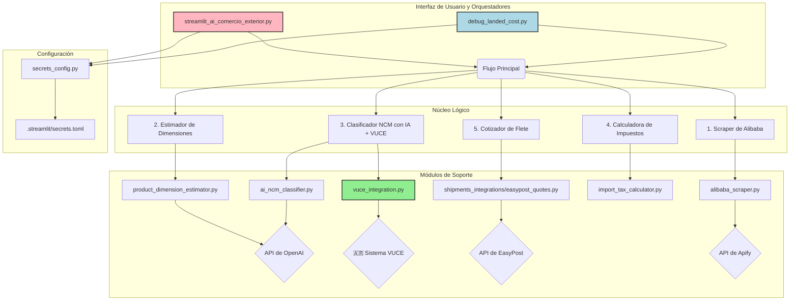

# 🤖 AI Comercio Exterior - Calculadora de Landed Cost

Este proyecto es una herramienta avanzada para calcular el **Landed Cost** (costo final puesto en destino) de productos importados desde Alibaba a Argentina. La aplicación utiliza IA para automatizar tareas complejas como la clasificación arancelaria y la estimación de dimensiones de paquetes, proporcionando un desglose de costos transparente y detallado con **validación oficial a través del sistema VUCE**.

## 🚀 Características Principales

- **Análisis de Productos de Alibaba**: Simplemente pega una URL de Alibaba y la aplicación extrae toda la información relevante.
- **Clasificación Arancelaria con IA + VUCE**: Utiliza `GPT-4o-mini` para analizar la descripción e imágenes del producto y determinar automáticamente el código NCM/HS, con **validación oficial contra el sistema VUCE de Argentina**.
- **Análisis de Régimen Simplificado**: Determina automáticamente si el producto puede acogerse al régimen simplificado de importación (RG 5631/2025).
- **Estimación de Flete con IA**: Estima el peso y las dimensiones del paquete para productos que no especifican esta información, un paso crucial para calcular el costo de envío.
- **Cálculo de Impuestos Detallado**: Calcula todos los impuestos de importación argentinos aplicables (Derechos, Tasa Estadística, IVA, Ganancias, etc.) usando **alícuotas oficiales de VUCE**.
- **Cotización de Flete Internacional**: Se integra con la API de EasyPost para obtener cotizaciones de envío reales de múltiples transportistas.
- **Interfaz Interactiva**: Una aplicación web creada con Streamlit que permite configurar el análisis y visualizar los resultados de forma clara.
- **Modo Debug**: Un script de consola para ejecutar el flujo completo con logs detallados, ideal para desarrollo y pruebas.

## 🏗️ Arquitectura del Proyecto

El proyecto está organizado en módulos, cada uno con una responsabilidad específica, lo que facilita su mantenimiento y escalabilidad.



### Componentes Clave:

-   **`streamlit_ai_comercio_exterior.py`**: El punto de entrada de la aplicación web. Controla la interfaz de usuario y orquesta el flujo de análisis.
-   **`debug_landed_cost.py`**: Un script para ejecutar el mismo flujo de análisis desde la consola, con logs detallados para depuración.
-   **`alibaba_scraper.py`**: Módulo encargado de extraer la información de un producto desde una URL de Alibaba utilizando la API de Apify.
-   **`product_dimension_estimator.py`**: Extrae o estima el peso y las dimensiones del producto. Utiliza `GPT-4o-mini` si los datos no están explícitamente disponibles.
-   **`ai_ncm_classifier.py`**: Clasifica el producto en el Nomenclador Común del Mercosur (NCM) usando `GPT-4o-mini` y valida con datos oficiales de VUCE.
-   **`vuce_integration.py`**: **⭐ NUEVO**: Módulo de integración con el sistema VUCE oficial de Argentina para validar códigos NCM, extraer alícuotas reales y analizar el régimen simplificado.
-   **`import_tax_calculator.py`**: Calcula los impuestos de importación basándose en el valor del producto y el tipo de importador.
-   **`shipments_integrations/easypost_quotes.py`**: Se conecta a la API de EasyPost para obtener cotizaciones de flete.
-   **`secrets_config.py` y `.streamlit/secrets.toml`**: Gestionan de forma segura todas las claves de API necesarias.

## 🇦🇷 Integración VUCE (Sistema Oficial Argentina)

### ¿Qué es VUCE?

VUCE (Ventanilla Única de Comercio Exterior) es el sistema oficial del gobierno argentino para consultar información arancelaria, posiciones NCM y requisitos de importación/exportación.

### Funcionalidades de Integración VUCE

- **Validación Oficial de NCM**: Verifica que el código NCM clasificado por IA existe en la base oficial argentina
- **Extracción de Alícuotas Reales**: Obtiene los porcentajes exactos de:
  - AEC (Arancel Externo Común)
  - DIE (Derechos de Importación Extrazona)  
  - DII (Derechos de Importación Intrazona)
- **Análisis de Régimen Simplificado**: Determina automáticamente la elegibilidad para régimen courier según RG 5631/2025
- **Detección de Intervenciones**: Identifica organismos que requieren intervención (ANMAT, SENASA, etc.)
- **Descripción Oficial**: Obtiene la descripción oficial del producto según nomenclador argentino

### Cómo Funciona

1. **Clasificación IA Primera**: El sistema usa GPT-4o-mini para clasificar el producto
2. **Validación VUCE**: Consulta automáticamente el sistema VUCE oficial para verificar el código NCM
3. **Combinación Inteligente**: Combina la inteligencia artificial con datos oficiales para máxima precisión
4. **Fallback Seguro**: Si VUCE no está disponible, usa datos de IA con advertencia clara

## 🔧 Instalación y Configuración

Sigue estos pasos para poner en marcha el proyecto:

### 1. Requisitos Previos

-   Python 3.8 o superior.
-   Una cuenta de [OpenAI](https://openai.com/) para obtener una API key.
-   Una cuenta de [EasyPost](https://www.easypost.com/) para obtener una API key.
-   Una cuenta de [Apify](https://apify.com/) para obtener una API key.
-   **Playwright**: Para la integración con VUCE (se instala automáticamente)

### 2. Clonar el Repositorio

```bash
git clone <URL_DEL_REPOSITORIO>
cd <NOMBRE_DEL_DIRECTORIO>
```

### 3. Instalar Dependencias

El proyecto utiliza `pip` para gestionar las dependencias. Instálalas con el siguiente comando:

```bash
pip install -r requirements.txt
```

**Instalar navegadores para Playwright (necesario para VUCE):**
```bash
playwright install
```

### 4. Configurar las API Keys

Las claves de API se gestionan de forma centralizada en el archivo `.streamlit/secrets.toml`.

1.  Asegúrate de que el directorio `.streamlit` exista en la raíz del proyecto.
2.  Crea un archivo llamado `secrets.toml` dentro de `.streamlit`.
3.  Copia y pega el siguiente contenido en el archivo y reemplaza los valores con tus propias claves de API:

```toml
# .streamlit/secrets.toml

[api_keys]
# Clave de OpenAI para la IA de clasificación y estimación
OPENAI_API_KEY = "sk-..."

# Clave de EasyPost para las cotizaciones de flete
EASYPOST_API_KEY = "EZAK..."

# Clave de Apify para el scraping de Alibaba
APIFY_API_KEY = "apify_api_..."
```

El sistema verificará automáticamente la presencia de estas claves al iniciar.

## 🚀 Cómo Usar la Aplicación

El proyecto se puede ejecutar de dos maneras: a través de la interfaz web con Streamlit o desde la consola para depuración.

### 1. Modo Interactivo (Streamlit)

Esta es la forma principal de usar la herramienta.

1.  **Iniciar la aplicación:**
    Ejecuta el siguiente comando en tu terminal desde la raíz del proyecto:

    ```bash
    streamlit run streamlit_ai_comercio_exterior.py
    ```

2.  **Usar la calculadora:**
    -   Se abrirá una pestaña en tu navegador con la aplicación.
    -   Pega la URL de un producto de Alibaba en el campo de entrada.
    -   Configura los parámetros de la importación en la barra lateral (opcional).
    -   Haz clic en "🔍 Analizar".
    -   La aplicación ejecutará el flujo completo y mostrará un desglose detallado del Landed Cost **con validación VUCE incluida**.

### 2. Modo de Depuración (Consola)

Este modo es ideal para desarrolladores o para analizar el flujo en detalle.

1.  **Ejecutar el script:**
    ```bash
    python debug_landed_cost.py
    ```
2.  **Analizar los resultados:**
    -   El script ejecutará el análisis para una URL de prueba definida en el propio archivo.
    -   Mostrará en la consola un log detallado de cada paso del proceso (scraping, clasificación IA, validación VUCE, cálculo de impuestos, etc.).
    -   Al finalizar, generará dos archivos JSON con los resultados completos y los logs de depuración.

## 🧪 Scripts de Prueba

El proyecto incluye scripts de prueba para validar componentes específicos:

- **`test_enhanced_classifier.py`**: Prueba la clasificación NCM con integración VUCE usando productos de ejemplo
- **`test_streamlit_integration.py`**: Simula el flujo completo de la aplicación Streamlit desde línea de comandos

### Ejecutar las Pruebas

```bash
# Probar clasificador con VUCE
python test_enhanced_classifier.py

# Probar integración completa
python test_streamlit_integration.py
```

## 📊 Resultados y Características

### Precisión del Sistema

- **Clasificación NCM**: ~75% de precisión con IA + validación oficial VUCE
- **Régimen Simplificado**: 100% de precisión (basado en normativa RG 5631/2025)
- **Cálculo de Impuestos**: Exacto (basado en alícuotas oficiales VUCE cuando disponible)

### Información Proporcionada

- **Producto**: Título, precio, MOQ, origen, categorías
- **NCM**: Código, descripción oficial, confianza de IA, match VUCE
- **Impuestos**: Desglose completo con alícuotas oficiales
- **Flete**: Cotizaciones reales de múltiples carriers
- **Régimen**: Análisis detallado de elegibilidad courier
- **Intervenciones**: Organismos que requieren autorización

### Exportación de Datos

- **JSON**: Reporte completo con todos los datos y metadata
- **Excel**: Próximamente
- **Debug**: Logs detallados para desarrolladores

## 🔧 Arquitectura Técnica

### Flujo de Datos con VUCE

1. **Input**: URL de Alibaba
2. **Scraping**: Extracción de datos con Apify
3. **Estimación**: Peso y dimensiones con IA
4. **Clasificación**: NCM con GPT-4o-mini
5. **Validación VUCE**: ⭐ Verificación oficial en tiempo real
6. **Cálculo**: Impuestos y flete
7. **Output**: Landing cost con validación oficial

### Manejo de Errores VUCE

- **Timeout**: Fallback a datos de IA con advertencia
- **Red**: Reintento automático hasta 3 veces
- **Sin Match**: Continúa con datos de IA, marca como no validado
- **Error Crítico**: Notifica al usuario pero no interrumpe el flujo

---

## 📋 Notas Técnicas

- **VUCE**: La integración usa Playwright para interactuar con el sistema oficial argentino
- **IA**: GPT-4o-mini balanceado entre costo y precisión
- **APIs**: EasyPost para flete, Apify para scraping
- **Datos**: Combina inteligencia artificial con fuentes oficiales
- **Actualizaciones**: El sistema VUCE se actualiza automáticamente desde fuente oficial

---

*Sistema desarrollado para automatizar y profesionalizar el análisis de importaciones desde Alibaba con validación oficial argentina.* 